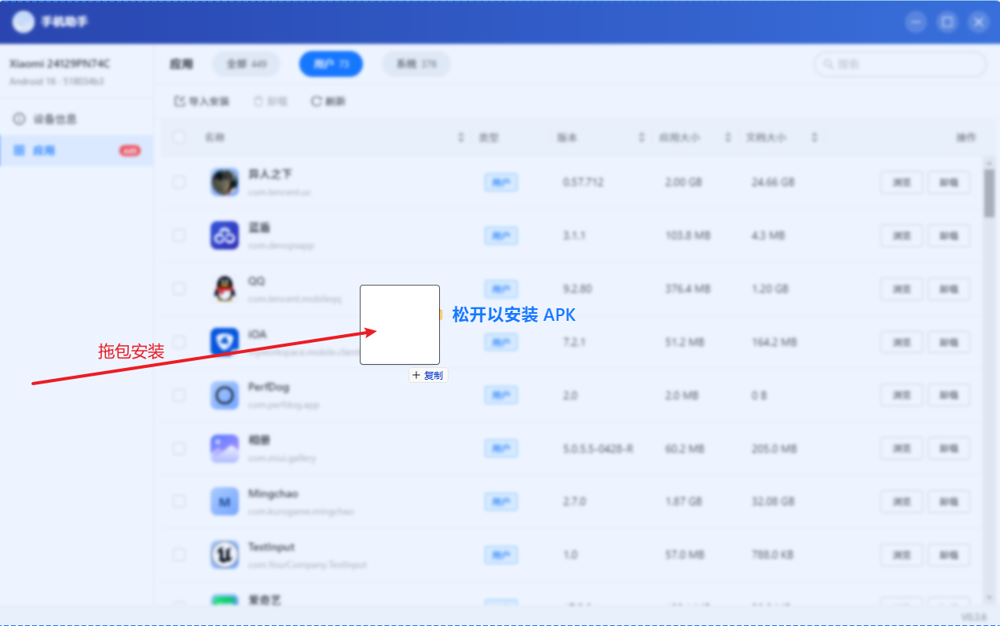
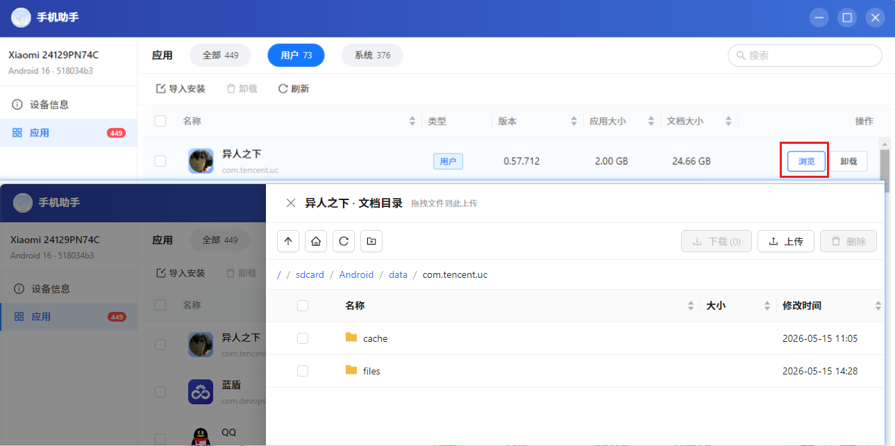
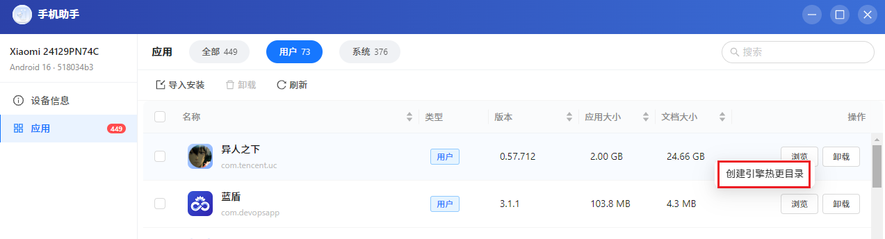

# Android Toolbox · 手机助手

> 一款无需敲命令的 Android 设备管理工具。基于 Electron + adbkit 构建，开箱即用。



## 功能特性

- **设备识别**：USB 连接 Android 设备后自动识别，支持多设备并行管理，实时插拔感知
- **设备详情**：型号 / 品牌 / Android 版本 / SDK / IMEI / MEID 一目了然
- **应用管理**：浏览用户 / 系统应用，支持搜索、批量选择、批量卸载、导出 APK
- **APK 安装**：拖拽 / 双击 / 多选安装，含进度反馈和错误提示
- **相册查看**：浏览设备图片并复制到 PC，流式加载体验流畅
- **截图 / 录屏**：一键截图，横屏游戏自动旋转回正显示
- **文件管理**：浏览设备文件系统，右键菜单支持创建引擎热更目录等常用操作





## 下载

前往 [Releases](../../releases) 页面下载最新版本的 `手机助手 Setup x.x.x.exe`。

**目前仅提供 Windows 版本**。macOS / Linux 支持在路线图中。

### 首次运行说明

应用尚未购买代码签名证书，Windows 首次运行可能出现：

> Windows 已保护你的电脑 — Microsoft Defender SmartScreen 阻止了启动…

点击 **「更多信息」 → 「仍要运行」** 即可。源码完全开源，可自行审计或自行编译。

## 使用前提

1. Android 设备开启 **开发者选项** → **USB 调试**
2. 通过 USB 线连接到电脑
3. 设备弹出"是否允许 USB 调试"时点击允许

应用已内置 `adb` 二进制，**无需单独安装 Android Platform-Tools**。

## 隐私

所有数据完全在本机处理，**不上传任何服务器**。详见 [PRIVACY.md](./PRIVACY.md)。

## 从源码构建

### 前置条件

- Node.js ≥ 18
- 仓库已内置 Windows 版 adb（`resources/adb/windows/`），直接构建即可

### 开发

```bash
npm install
npm run dev
```

### 打包

```bash
npm run build
```

产物输出到 `release/v<version>/` 目录。

## 技术栈

- **Electron 32** — 跨平台桌面壳
- **Vite 5 + React 18 + TypeScript** — 前端
- **Ant Design 5** — UI 组件库
- **@devicefarmer/adbkit** — 纯 Node 实现的 adb 协议客户端
- **zustand** — 状态管理
- **electron-builder** — 打包

## 项目结构

```
src/
├── main/            # Electron 主进程
│   ├── index.ts
│   └── adb/         # adb 客户端 / 设备 / 应用 / IPC handlers
├── preload/         # 安全暴露 API 给渲染层
├── renderer/        # React 前端
│   ├── pages/       # Devices / Apps / Gallery / DeviceInfo
│   ├── components/
│   └── store/       # zustand store
└── shared/
    └── types.ts     # 主/渲染共享类型
```

## 反馈与贡献

- Bug 反馈：[提 Issue](../../issues/new?template=bug_report.md)
- 功能建议：[提 Issue](../../issues/new?template=feature_request.md)
- 欢迎 PR

## 第三方组件

详见 [THIRD_PARTY_NOTICES.md](./THIRD_PARTY_NOTICES.md)。本项目使用了 Google Platform-Tools 的 `adb`（Apache-2.0）。

## License

[MIT](./LICENSE)
